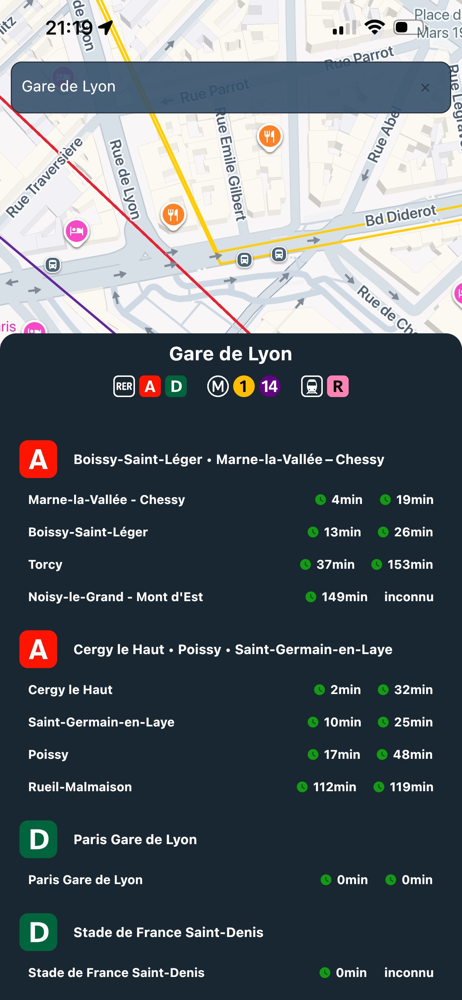

# Schedulines – Metro & RER Schedules for Île-de-France

[](LICENSE)
[](#)
[](#)
[](#)


Schedulines is a mobile application providing **real-time metro and RER schedules** in Île-de-France (IDF), available on **Android** and **iOS**.

## Features
- View metro and RER schedules in real-time.
- Search by station.
- View metro and RER line routes 

---

## 🖼️ Screenshots
<p float="left">
  
  
</p>

---

## 💻 Installation

### Android
1. Clone the repository:
   ```bash
   git clone https://github.com/Ancelotow/schedulines.git
   ```
2. Open the project in Android Studio.
3. Build and run the app on an emulator or physical device.

### IOS

1. Clone the repository:
   ```bash
   git clone https://github.com/Ancelotow/schedulines.git
   ```
2. Open Schedulines.xcworkspace in Xcode.
3. Build and run the app on a simulator or physical device.
4. Ensure you have a valid Apple Developer account for signing.

---

## ⚙️ Requirements
- Android Studio or Xcode.
- iOS 15+ or Android 8+.
- Internet connection for real-time schedules.

## 🚀 Usage
1. Open the app.
2. Select a station. (ex: "Gare de Lyon")
3. Check upcoming trains at your station.

## 🤝 Contributing
1. Fork the repository.
2. Create a new branch for your feature or fix.
3. Commit your changes.
4. Submit a pull request.

## ⚖️ License
This project is licensed under the MIT License.
See the [LICENSE](https://github.com/Ancelotow/schedulines/blob/main/LICENSE) file for details.

## 📬 Contact
- Author: Owen ANCELOT
- Email: ancelotow@icloud.com
- GitHub: [Ancelotow](https://github.com/Ancelotow)
